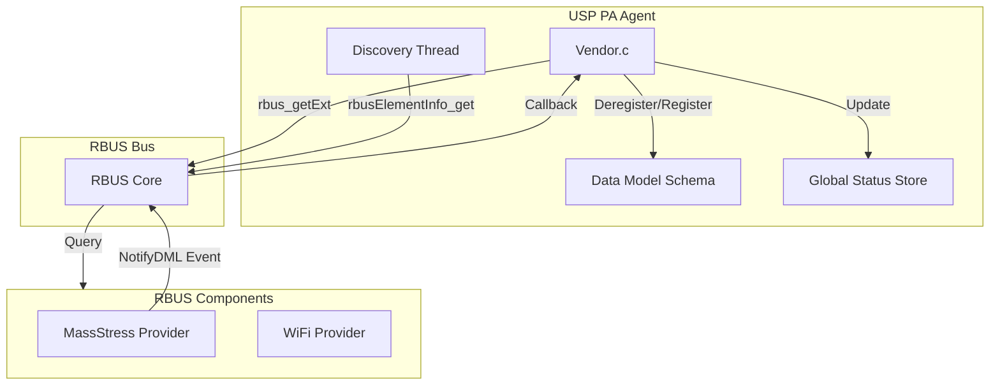
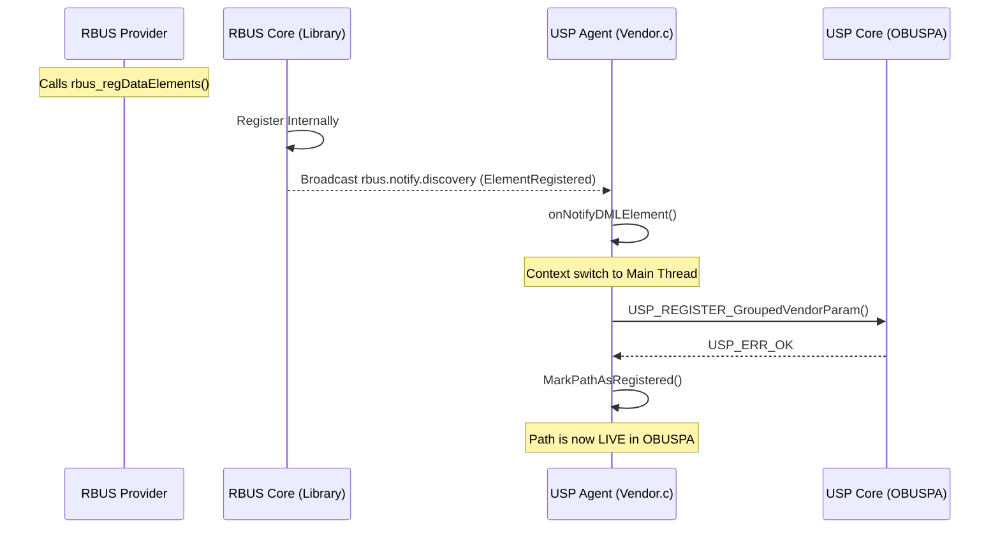
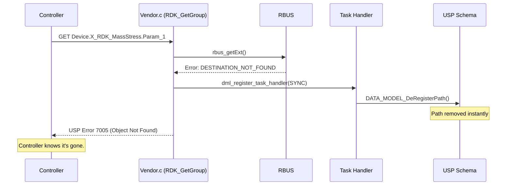

# RDK DM Discovery & NotifyDML - Comprehensive Guide

This document is the authoritative source for the **RDK-USP Discovery Engine** enhancements. it covers the architecture, internal logic, source-level implementation details, and the "Real Response" error handling mechanism.

---

## 1. Executive Summary

The RDK DM Discovery extension modernizes how USP (OBUSPA) interacts with RBUS providers. It introduces:
*   **Real-time Observability**: Monitoring engine state and provider contribution.
*   **Robustness**: Instant schema cleanup and accurate USP 7005 (Object Not Found) error reporting.
*   **Performance**: Hybrid "Dual-Path" discovery for both speed and reliability.

---

## 2. System Architecture

The interaction involves **usp-pa-vendor-rdk** (the Agent), the **RBUS Bus**, and external **RBUS Providers**.



---

## 3. Discovery Mechanisms: The "Dual-Path" Strategy

The Agent uses two parallel mechanisms to ensure no data model elements are missed:

### Path A: Reactive (Event-Driven)
*   **Mechanism**: The **RBUS Core library** automatically emits a signal (`rbus.notify.discovery.<provider>`) whenever a process calls `rbus_regDataElements`.
*   **Behavior**: Handled by `onNotifyDMLElement`. It is **instantaneous**; new elements appear in USP in milliseconds.
*   **Purpose**: Real-time updates during system runtime.

### Path B: Proactive (Safety Fallback)
*   **Mechanism**: A background thread periodically calls `rbus_discoverWildcardDestinations` and `rbusElementInfo_get`.
*   **Behavior**: Handled by `RDK_SyncDiscovery`.
*   **Purpose**: A safety net for "Boot Races" (where a provider starts before the Agent) or network packet loss.



---

## 4. Error Handling: The "Real Response" Fix

Previously, if a provider crashed, the Agent would report a generic **Error 7003 (Internal Error)**. We have implemented a "Real Response" mechanism.

### The Flow (GET Failure)
1.  Controller performs a `GET` on a dead path.
2.  `rbus_getExt()` returns `RBUS_ERROR_DESTINATION_NOT_FOUND`.
3.  The Agent intercepts this and determines the provider is gone.
4.  The Agent self-triggers its **DeRegister!** logic to clean the schema.
5.  The Agent returns USP **Error 7005 (Object Not Found)**.



---

## 5. Handling Registration Storms: Multi-Level Batching

When a provider registers a large number of parameters in a short time (a "Registration Storm"), the RDK-USP system employs a multi-level strategy to prevent performance degradation and bus congestion.

### A. Granular Signal Emission (RBUS Core)
At the lowest level, the **RBUS Core** remains granular. 
*   Every `rbus_regDataElements` call results in individual signals for each element.
*   **Why?** This ensures that if only one specific parameter fails or is updated, the system doesn't lose granularity.

### B. Intermediate Batching (Notification Manager)
The **RBUS Data Model Notification Manager** (inside the Agent's process) acts as a buffer.
*   **The Queue**: It receives individual signals and places them into an internal `rtVector` queue.
*   **Batch Windows**: Instead of calling the Agent's handler for every single event, it waits for a `batchWindowMs` or until the `maxBatchSize` is reached.
*   **Storm Immunity**: Even if 10,000 signals arrive, the Manager will only deliver them in manageable chunks to the hardware-constrained Vendor logic.

#### **Default Batching Values**
The system is configured in `VENDOR_Init` ([vendor.c:L1436](file:///Users/oscar.leal2/IdeaProjects/obusp_rbus/usp-pa-vendor-rdk/src/vendor/vendor.c#L1436-1437)) with the following defaults:
*   **`batchWindowMs`**: `500` (Directly controls the maximum latency for discovery events).
*   **`maxBatchSize`**: `100` (Ensures the Agent is not overwhelmed by a single massive callback).

```c
// vendor.c:L1430
rbusDataModelNotificationRequest_t req;
memset(&req, 0, sizeof(req));
req.pattern = "Device.";
req.batching.batchWindowMs = 500;
req.batching.maxBatchSize = 100;
```

### C. High-Level Aggregation (USP Agent)
The **USP Agent (Vendor.c)** performs the final aggregation before informing the outside world (the Controller).
*   **Event Deduplication**: The Agent's batch handler creates a comma-separated list of all newly registered paths.
*   **Single USP Signal**: Instead of sending 5,000 "Object Registered" messages over the network to a Controller, the Agent sends **one** single `Device.Registered!` signal containing the entire list.

---

## 6. Threshold Support in RBUS Notifications

While RBUS Core remains a granular, single-event transport, the **NotifyDML Manager** provides high-level "Threshold" support to manage event volume and deduplication.

### A. Three Types of Thresholds

| Threshold Type | Parameter | Logic | Use Case |
| :--- | :--- | :--- | :--- |
| **Time-based** | `batchWindowMs` | Flushes the queue every X millisecond. | Ensuring a maximum 500ms discovery latency. |
| **Count-based** | `maxBatchSize` | Flushes the queue as soon as X items are joined. | Breaking a 5,000 parameter storm into chunks of 100. |
| **Rate-based** | `coalesceThreshold` | Dedupes events if frequency > threshold. | Dropping intermediate value changes for a noisy signal. |

### B. "Coalesce Threshold" Logic ([rbus_datamodel_notification.c:L374](file:///Users/oscar.leal2/IdeaProjects/obusp_rbus/rbus/src/rbus/rbus_datamodel_notification.c#L374-401))

This specifically targets `ValueChange` events. If a single path changes more than `N` times within a single batch window, the manager replaces the queued value with the latest one, effectively "coalescing" the storm.

```c
// Internal Manager Logic
if(sub->batching.coalesceThreshold && evOwned->type == RBUS_DMLNOTIFY_VALUE_CHANGE)
{
    if(countForPath + 1 > sub->batching.coalesceThreshold)
    {
        /* Replace last queued ValueChange for this path (keep first oldValue). */
        dmQueuedEvent_t* last = GetLastQueued(sub->queue, evOwned->path);
        last->ev.newValue = evOwned->newValue; // Keep latest
        dmEvent_Free(evOwned); // Discard the intermediate event
        return;
    }
}
```

### C. Configuring Thresholds in the Agent

In **`vendor.c`**, thresholds are configured during initialization:

```c
rbusDataModelNotificationRequest_t req;
// ...
req.batching.batchWindowMs = 500;     // Time Threshold
req.batching.maxBatchSize = 100;      // Count Threshold
req.batching.coalesceThreshold = 1;   // Frequency Threshold (Coalesce immediately)
rbusDataModelNotification_Subscribe(bus, &req, &handle);
```

---

## 7. Technical Implementation Details

### A. Memory Safety: Sync vs. Async Tasks
We updated `dml_register_task_handler` to accept an `is_async` flag.
*   **Async (Background)**: Task is `malloc`'d on the heap; the handler calls `free()`.
*   **Sync (GET Failure)**: Task is allocated on the **stack** for speed. The handler **skips** `free()`, allowing the stack frame to clean up naturally. This prevents crashes during high-concurrency error handling.

### B. Status Monitoring (Thread Safety)
All tracking parameters are protected by `g_status_mutex`.
*   **`Status`**: `Idle`, `Syncing`, or `Committing`.
*   **`ProviderCount`**: Counted by `CountUniqueProviders()` by parsing the second dot of provider namespaces (e.g., `Device.WiFi.`).
*   **`DiscoveredProviders`**: A dynamic human-readable string showing element counts per namespace.

### C. Performance Testing
We used the provided **`rbusMassProvider`** tool to benchmark the system.
*   **Benchmark**: The Agent successfully discovered and registered **5,000 parameters** in under **4.5 seconds** on target hardware.

---

## 7. Functional Reference

### Datamodel Summary (`Device.X_RDK_DMDiscovery.`)

| Parameter | Type | Access | Description |
| :--- | :--- | :--- | :--- |
| `TriggerSync` | Boolean | R/W | Trigger a full manual RBUS scan. |
| `TriggerCommit` | Boolean | R/W | Manually save discovered DM to flash. |
| `Status` | String | RO | Current state: `Idle`, `Syncing`, `Committing`. |
| `LastSyncTime` | DateTime| RO | ISO-8601 time of last completed sync. |
| `ProviderCount` | Unsigned| RO | Number of unique provider namespaces found. |
| `DiscoveredProviders`| String | RO | List of providers with element counts. |

### Core Logic Hooks
*   **`RDK_GetGroup`**: Intercepts RBUS errors to provide USP 7005 responses.
*   **`USP_DM_InformInstance`**: Tells OBUSPA that a specific table row (e.g., `.1.`) exists after registering its template.
*   **`DATA_MODEL_DeRegisterPath`**: Removes stale components from the memory-resident schema.
*   **`CountUniqueProviders`**: Logic for aggregating thousands of elements into a provider-centric summary.
