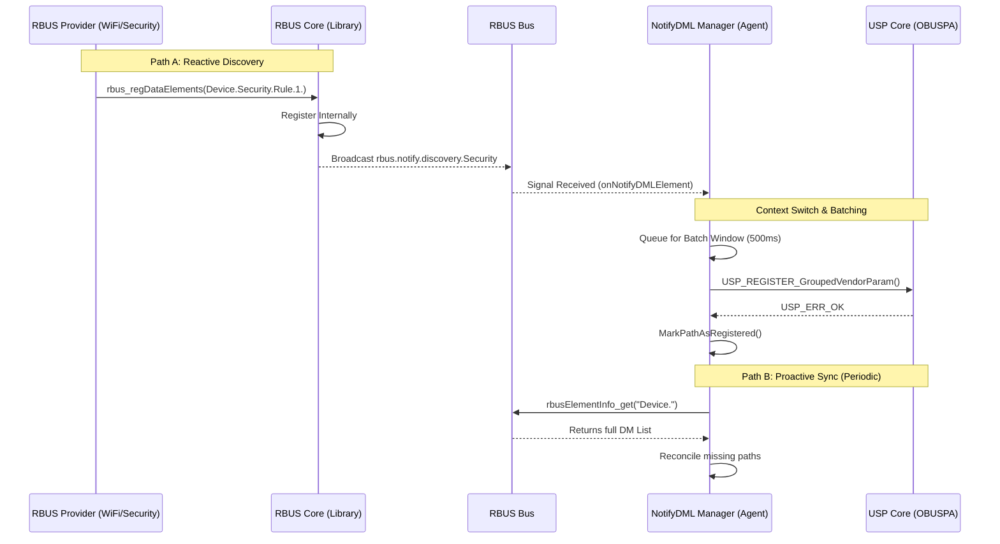

# RDK DM Discovery & NotifyDML - Technical Master Guide

This document provides a deep-dive into the architecture and implementation of the **RDK-USP Data Model Discovery Extension**. It covers the interaction between RBUS signals, the NotifyDML Manager, and the USP Agent.

---

## 1. System Architecture & Components

The discovery system is divided into three distinct operational layers:

### A. The RBUS Provider (Component Layer)
Any CPE application (e.g., **WiFi Manager**, **Security Component**) that owns data model elements. 
*   **Action**: Calls `rbus_regDataElements`.
*   **Signal**: The RBUS Core library automatically broadcasts a signal on the bus: `rbus.notify.discovery.<component_name>`.
*   **Context**: This signal is **component-based**. If the WiFi Manager registers 10 parameters, it sends one discovery signal identifying itself as the source.

### B. The RBUS Core (Library Layer)
The low-level C library linked into every process. It provides the transport mechanism and the initial discovery broadcast. It is "unaware" of USP; its only job is to announce that a data model has changed within a specific process.

### C. NotifyDML Manager (Management Layer)
A specialized engine developed to bridge RBUS and USP. It lives inside the USP Agent and provides the "intelligence" for discovery.
*   **Difference vs RBUS Core**: While RBUS Core just "shouts" that something happened, the **NotifyDML Manager** listens, queues, filters, and batches those shouts into a format the USP data model can digest without crashing.

---

## 2. Discovery Mechanisms: The "Dual-Path" Strategy



---

## 3. Registration Flows

### **The "Single Item" Flow (Reactive)**
Used for real-time updates when a component adds a small number of elements (e.g., a new WiFi Radio).
*   **Mechanism**: Based on the `rbus.notify.discovery` signal.
*   **Code Reference**: `vendor.c::onNotifyDMLElement`
```c
// vendor.c:1440
req.handler = onNotifyDMLElement; 
// Inside onNotifyDMLElement:
task->path = strdup(ev->path);
task->type = (int)ev->type;
USP_PROCESS_DoWork(dml_register_task_handler, task, (void*)1);
```

### **The "Storm" Flow (Batching)**
Used when a component (e.g., Security Firewall) registers hundreds of rules at once.
*   **Mechanism**: The NotifyDML Manager aggregates individual signals based on `batchWindowMs`.
*   **Code Reference**: `vendor.c::onNotifyDMLBatch`
```c
// vendor.c:1441
req.batchHandler = onNotifyDMLBatch;
// Inside onNotifyDMLBatch:
for (i = 0; i < batch->count; i++) {
    // Process multiple events in one context switch
    USP_LOG_Info("Event[%u]: path=%s", i, batch->events[i].path);
    // ... logic to aggregate additions into a single USP signal ...
}
```

---

## 4. Unregistration Handling (Crashes & Deletions)

The system handles both single unregistrations and massive "component gone" events.

1.  **Single Unregister**: Handled via `RBUS_DMLNOTIFY_OBJECT_DELETION` signal in the batch handler.
2.  **Batch/Component Crash**: 
    *   If a component crashes, `rbus_getExt` returns `RBUS_ERROR_DESTINATION_NOT_FOUND`.
    *   The Agent intercepts this and performs a **Synchronous Batch Deregistration** of all parameters belonging to that component.
    *   **Result**: The USP controller gets an immediate **7005 (Object Not Found)** error instead of a generic timeout.

---

## 5. Implementation Roadmap (Files & Functions)

### **A. NotifyDML Manager (`rbus_datamodel_notification.c/h`)**
*   **Purpose**: A generic, reusable engine for RBUS to handle complex data model signals.
*   **Key Functions**:
    *   `rbusDataModelNotificationManager_Create`: Initializes the background thread and signal listeners.
    *   `dmQueueOrDeliver`: The core logic that decides whether to send a signal immediately or put it in a batch bucket.
    *   `dmThread`: Manages the timing for `batchWindowMs` and flushes the queue.

### **B. USP Agent Integration (`vendor.c`)**
*   **Purpose**: Connects the NotifyDML signals to the OBUSPA data model.
*   **Key Functions**:
    *   `VENDOR_Init`: Subscribes to `Device.` and sets thresholds (`500ms`, `maxBatchSize=100`).
    *   `dml_register_task_handler`: Safely switches from the RBUS background thread to the USP Main Loop to avoid thread-safety crashes.
    *   `PathToSchema`: Converts concrete paths (`Device.WiFi.Radio.1.`) to USP schema formats (`Device.WiFi.Radio.{i}.`).
    *   `RDK_GetGroup`: Detects crashed providers and triggers cleanup.

### **C. Build System (`CMakeLists.txt`)**
*   **Purpose**: Ensures all projects (RBUS, Vendor, OBUSPA) are linked correctly.
*   **Change**: Added `-DUSE_DISTINCT_DML_NOTIFY` and linked `librbus` to the USP Agent.

---

## 6. Optimization Logic
*   **Time Threshold (`batchWindowMs`)**: Flushes queue every 500ms.
*   **Count Threshold (`maxBatchSize`)**: Flushes immediately if 100 items are queued.
*   **Coalescing**: If a parameter changes rapidly, only the final state is processed, reducing USP overhead.
