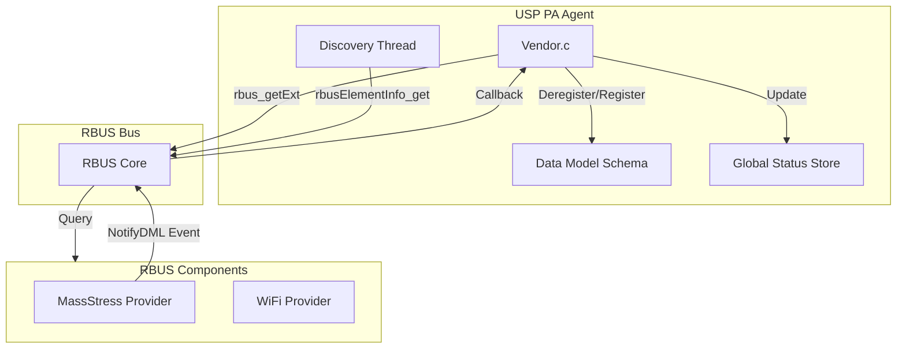
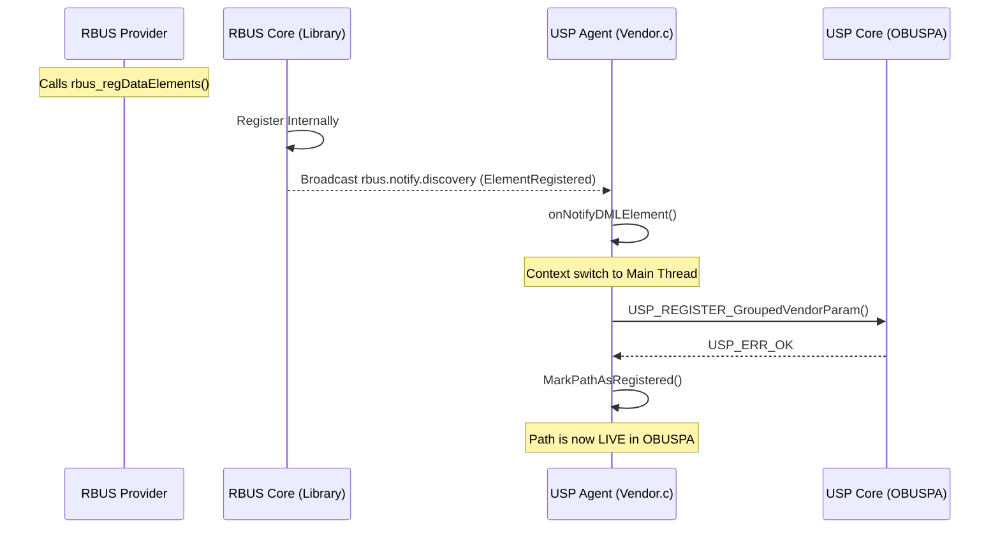
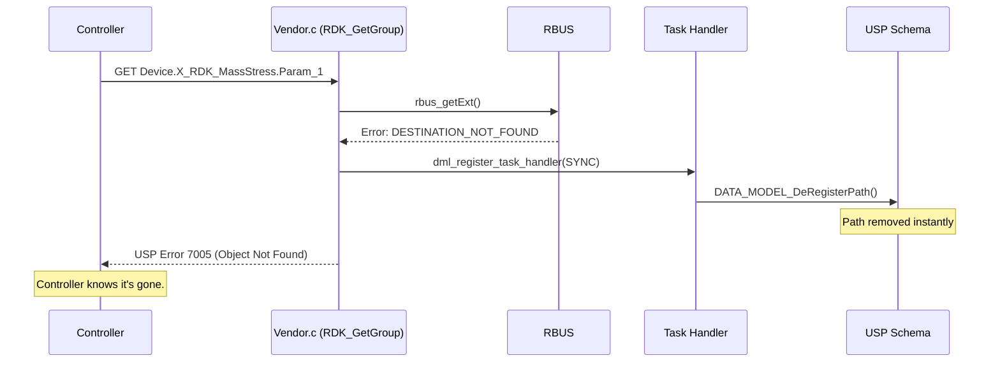

# RDK DM Discovery & NotifyDML - Comprehensive Guide

This document is the authoritative source for the **RDK-USP Discovery Engine** enhancements. it covers the architecture, internal logic, source-level implementation details, and the "Real Response" error handling mechanism.

---

## 1. Executive Summary

The RDK DM Discovery extension modernizes how USP (OBUSPA) interacts with RBUS providers. It introduces:
*   **Real-time Observability**: Monitoring engine state and provider contribution.
*   **Robustness**: Instant schema cleanup and accurate USP 7005 (Object Not Found) error reporting.
*   **Performance**: Hybrid "Dual-Path" discovery for both speed and reliability.

---

## 2. System Architecture

The interaction involves **usp-pa-vendor-rdk** (the Agent), the **RBUS Bus**, and external **RBUS Providers**.

---

## 3. Discovery Mechanisms: The "Dual-Path" Strategy

The Agent uses two parallel mechanisms to ensure no data model elements are missed:

### Path A: Reactive (Event-Driven)
*   **Mechanism**: The **RBUS Core library** automatically emits a signal (`rbus.notify.discovery.<provider>`) whenever a process calls `rbus_regDataElements`.
*   **Behavior**: Handled by `onNotifyDMLElement`. It is **instantaneous**; new elements appear in USP in milliseconds.
*   **Purpose**: Real-time updates during system runtime.

### Path B: Proactive (Safety Fallback)
*   **Mechanism**: A background thread periodically calls `rbus_discoverWildcardDestinations` and `rbusElementInfo_get`.
*   **Behavior**: Handled by `RDK_SyncDiscovery`.
*   **Purpose**: A safety net for "Boot Races" (where a provider starts before the Agent) or network packet loss.

---

## 4. Error Handling: The "Real Response" Fix

Previously, if a provider crashed, the Agent would report a generic **Error 7003 (Internal Error)**. We have implemented a "Real Response" mechanism.

### The Flow (GET Failure)
1.  Controller performs a `GET` on a dead path.
2.  `rbus_getExt()` returns `RBUS_ERROR_DESTINATION_NOT_FOUND`.
3.  The Agent intercepts this and determines the provider is gone.
4.  The Agent self-triggers its **DeRegister!** logic to clean the schema.
5.  The Agent returns USP **Error 7005 (Object Not Found)**.

---

## 5. Technical Implementation Details

### A. Memory Safety: Sync vs. Async Tasks
We updated `dml_register_task_handler` to accept an `is_async` flag.
*   **Async (Background)**: Task is `malloc`'d on the heap; the handler calls `free()`.
*   **Sync (GET Failure)**: Task is allocated on the **stack** for speed. The handler **skips** `free()`, allowing the stack frame to clean up naturally. This prevents crashes during high-concurrency error handling.

### B. Status Monitoring (Thread Safety)
All tracking parameters are protected by `g_status_mutex`.
*   **`Status`**: `Idle`, `Syncing`, or `Committing`.
*   **`ProviderCount`**: Counted by `CountUniqueProviders()` by parsing the second dot of provider namespaces (e.g., `Device.WiFi.`).
*   **`DiscoveredProviders`**: A dynamic human-readable string showing element counts per namespace.

### C. Performance Testing
We used the provided **`rbusMassProvider`** tool to benchmark the system.
*   **Benchmark**: The Agent successfully discovered and registered **5,000 parameters** in under **4.5 seconds** on target hardware.

---

## 6. Functional Reference

### Datamodel Summary (`Device.X_RDK_DMDiscovery.`)

| Parameter | Type | Access | Description |
| :--- | :--- | :--- | :--- |
| `TriggerSync` | Boolean | R/W | Trigger a full manual RBUS scan. |
| `TriggerCommit` | Boolean | R/W | Manually save discovered DM to flash. |
| `Status` | String | RO | Current state: `Idle`, `Syncing`, `Committing`. |
| `LastSyncTime` | DateTime| RO | ISO-8601 time of last completed sync. |
| `ProviderCount` | Unsigned| RO | Number of unique provider namespaces found. |
| `DiscoveredProviders`| String | RO | List of providers with element counts. |

### Core Logic Hooks
*   **`RDK_GetGroup`**: Intercepts RBUS errors to provide USP 7005 responses.
*   **`USP_DM_InformInstance`**: Tells OBUSPA that a specific table row (e.g., `.1.`) exists after registering its template.
*   **`DATA_MODEL_DeRegisterPath`**: Removes stale components from the memory-resident schema.
*   **`CountUniqueProviders`**: Logic for aggregating thousands of elements into a provider-centric summary.
