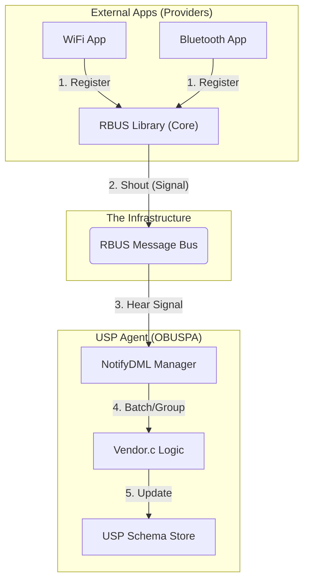

# RDK DM Discovery & NotifyDML - Comprehensive Master Guide

This document is the definitive guide for understanding, implementing, and maintaining the **RDK-USP Data Model Discovery Engine**. It is designed to be accessible to beginners ("For Dummies") while providing the exhaustive technical depth required by system architects and developers.

---

## 1. Core Concepts: The "RDK Post Office" Analogy

To understand how a new parameter (like a piece of mail) gets from a component to your phone (USP Controller), imagine a city-wide postal system:

| Component | Analogy | Real World Description |
| :--- | :--- | :--- |
| **RBUS Provider** | **The Sender** | An application (like WiFi or Bluetooth) that has new data to share. It "writes the letter" by calling `rbus_regDataElements`. |
| **RBUS Core (Library)** | **Local Post Office** | A piece of code linked *inside* the Provider app. It immediately notices the "mail" and tells the bus: "Hey, something new just arrived!" |
| **RBUS Bus** | **The Mail Truck** | The communication system that carries the "Hey, I'm here!" signal across the entire device. |
| **USP Agent (NotifyDML)** | **The Sorting Facility** | A dedicated engine inside the USP Agent that listens for those signals. It collects them, groups them (Batching), and prepares them for final delivery. |
| **USP Core (OBUSPA)** | **The Recipient's House** | The final destination. Once sorted and registered here, the parameters are officially "LIVE" and can be seen by the outside world. |

---

## 2. Supported vs. Instantiated: "The Blueprint vs. The House"

In the world of USP and RDK, there is a CRITICAL difference between these two terms:

### **Supported Data Model (The Blueprint)**
*   **What it is**: A list of everything that *could* exist on the device.
*   **Analogy**: A real estate blueprint that shows a house *could* have 5 bedrooms and a pool. The bedrooms aren't built yet, but we know where they would go.
*   **USP Command**: `GetSupportedDM`.

### **Instantiated Data Model (The Building)**
*   **What it is**: The parts of the data model that are **actually active and have data right now**.
*   **Analogy**: The house is built, but currently only 2 bedrooms are finished and occupied. The "Discovery Engine" is what notices when a 3rd bedroom is finished and "Registers" it.
*   **USP Command**: `Get` (on a specific object).

> [!IMPORTANT]
> The RDK DM Discovery Extension's job is to bridge the gap: it watches for **Instantiated** elements appearing on the bus and automatically updates the USP schema so they become **Accessible**.

---

## 3. Simplified Architecture

The system uses a **layered approach** to separate the "doing" (Provider) from the "tracking" (Agent).

---

## 4. Discovery Flows: Single vs. Batch

### **The "Single Item" Flow (Reactive)**
When a provider registers one single parameter:
1.  **Provider** calls `rbus_regDataElements`.
2.  **RBUS Core** emits a signal: `rbus.notify.discovery.WiFi`.
3.  **Agent** receives the signal instantly.
4.  **Agent** updates the schema: "Device.WiFi.Radio.1.Status" is now available.

### **The "Storm" Flow (Batching)**
When a provider (like `rbusMassProvider`) registers **5,000 parameters** at once:
1.  **RBUS Core** sends 5,000 signals as fast as possible.
2.  **The Manager (Batching)**: Instead of telling the Agent 5,000 times, it puts the signals in a "Bucket" (the Queue).
3.  **The Thresholds**: 
    *   It waits **500ms** OR until **100 items** are in the bucket.
4.  **The Delivery**: The Manager gives the Agent a "Batch" of 100 items at a time.
5.  **Aggregation**: The Agent tells the Controller: "Here are 100 new things that just appeared!" (using a single `Device.Registered!` signal).

---

## 5. Handling Unregistration (Deletions)

What happens when a provider crashes or shuts down?

### **Path A: The Quiet Exit (Reactive)**
If the provider shuts down gracefully, it sends an `ElementUnregistered` signal. The Agent hears it and removes the path from USP instantly.

### **Path B: The Crash (The "Real Response" Fix)**
If a provider "vanishes" (crashes):
1.  The Controller tries to `GET` a parameter from the dead provider.
2.  RBUS returns: **DESTINATION_NOT_FOUND**.
3.  The Agent realizes the provider is gone.
4.  **Immediate Action**: The Agent runs a **Synchronous Deletetion** in the middle of the request.
5.  **Final Result**: The Agent sends back USP **Error 7005 (Object Not Found)** instead of a generic "Internal Error".

---

## 6. Threshold & Optimization Logic

The **NotifyDML Manager** (inside `rbus_datamodel_notification.c`) uses three knobs to keep the system fast:

| Feature | Param | Logic | Why? |
| :--- | :--- | :--- | :--- |
| **Time Threshold** | `batchWindowMs` | "Wait X ms before telling the Agent" | Prevents the CPU from maxing out during a storm. |
| **Count Threshold** | `maxBatchSize` | "Don't hold more than X items in the bucket" | Ensures the "Sorting Facility" doesn't run out of memory. |
| **Coalesce** | `coalesceThreshold` | "If P.Status changes 10 times, only send the last one" | Drops intermediate noise for values that change too fast. |

---

## 7. Technical Implementation Reference (Source Code)

### **Key Files & Functions**

*   **`vendor.c`**:
    *   `VENDOR_Init`: Sets defaults (`batchWindowMs = 500`, `maxBatchSize = 100`).
    *   `onNotifyDMLBatch`: Iterates through a batch and aggregates them into one USP signal.
    *   `RDK_GetGroup`: The "Real Response" logic (intercepts DESTINATION_NOT_FOUND).
*   **`rbus_datamodel_notification.c`**:
    *   `dmQueueOrDeliver`: The main queuing engine for batching.
    *   `dmThread`: The background thread that monitors batch windows and discovery signals.

### **Memory Management (Expert Level)**
The system uses `dml_register_task_handler` with a safety flag:
*   **Sync (GET Failure)**: Uses **Stack Memory** (no `free()` needed, zero risk of leak).
*   **Async (Discovery)**: Uses **Heap Memory** (standard `malloc/free`).

---

## 8. Summary for Developers
*   **Granularity**: RBUS follows single events; NotifyDML follows batches.
*   **Reliability**: Hybrid "Dual-Path" ensures elements are found even if signals are missed.
*   **Safety**: Automatic cleanup for gone/crashed providers avoids stale data models.
