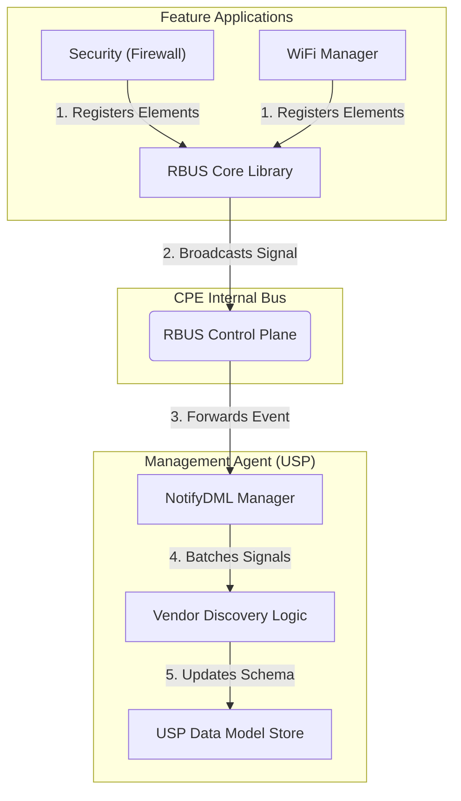

# RDK DM Discovery & NotifyDML - Comprehensive Master Guide

This document is the definitive guide for understanding, implementing, and maintaining the **RDK-USP Data Model Discovery Engine**. It uses real-world Router (CPE) examples to ensure technical accuracy and clarity.

---

## 1. Core Components in a CPE Environment

To understand how a new feature or setting (e.g., a Security Rule) travels from a software component to the USP Controller, we must identify the participating layers:

| Component | Role in CPE | Detailed Description |
| :--- | :--- | :--- |
| **RBUS Provider** | **The Feature App** | An application like **WiFi Manager** or a **Security Firewall**. It registers new capabilities by calling `rbus_regDataElements`. |
| **RBUS Core (Library)** | **Signal Generator** | Internal logic linked into the Feature App. It immediately generates an event signal when a parameter is registered. |
| **RBUS Bus** | **The Control Plane** | The internal communication system that broadcasts registration signals across all router processes. |
| **USP Agent (NotifyDML)** | **The Discovery Engine** | A central service that listens for signals, aggregates them into batches, and updates the USP schema. |
| **USP Core (OBUSPA)** | **The Management Interface** | The final repository. Once shared here, the feature is visible to the Cloud/App Controller. |

---

## 2. Supported vs. Instantiated: "Firmware Capability vs. Active State"

In CPE management, the distinction between what *can* exist and what *does* exist is vital:

### **Supported Data Model (Firmware Blueprint)**
*   **Definition**: The set of all parameters and objects the device is programmed to understand.
*   **CPE Example**: The router firmware supports **WiFi 6GHz (Radio.3)**. Even if the hardware isn't active, the "blueprint" for Radio.3 exists in the code.
*   **USP Query**: `GetSupportedDM`.

### **Instantiated Data Model (Runtime Reality)**
*   **Definition**: The specific instances and parameters that are currently live and holding data.
*   **CPE Example**: A user enables a **Guest WiFi Network**. The `Device.WiFi.SSID.2.` instance is "Instantiated" (created) at that moment.
*   **Discovery Job**: The Discovery Engine watches for these **Instantiated** elements appearing on the RBUS and maps them to the USP tree.

---

## 3. System Architecture (Router Context)

The system manages the flow from hardware-level features to high-level management interfaces.

---

## 4. Registration Flows: Single vs. Batch

### **The "Single Feature" Trace (WiFi Radio)**
When the WiFi Manager brings a new radio online:
1.  **WiFi Manager** calls `rbus_regDataElements` for `Device.WiFi.Radio.1.`.
2.  **RBUS Core** emits a signal: `rbus.notify.discovery.WiFi`.
3.  **Discovery Engine** hears the signal and triggers an internal registration task.
4.  **Result**: Within milliseconds, the Radio appears in the USP Data Model.

### **The "Security Storm" Trace (Firewall Rules)**
When a Security Component registers **500 Firewall Rules** during a boot sequence:
1.  **Security App** sends 500 signals rapidly.
2.  **Batching Logic**: The NotifyDML Manager collects these individual signals into a queue.
3.  **Threshold Enforcement**: 
    *   It waits **500ms** OR until **100 rules** are queued.
4.  **Aggregated Update**: The Engine delivers 100 rules at once to the USP Schema Store.
5.  **Efficiency**: This prevents the router CPU from spiking by reducing the number of context switches between the Bus and the Management Agent.

---

## 5. Security & Stability: Handling Crashes

Dynamic discovery includes safeguards for when components fail or restart.

### **Graceful Shutdown**
When a component like the **Bluetooth Manager** stops, it unregisters its paths. The Engine hears the signal and cleans up the USP model seamlessly.

### **Component Crash Protection**
If the **Security Component** crashes while holding 100 firewall rules:
1.  The Controller tries to `GET` a rule.
2.  RBUS returns **DESTINATION_NOT_FOUND**.
3.  **Real Response Fix**: The Agent detects the crash, performs a **Synchronous Cleanup** of all paths belonging to that component, and notifies the Controller.
4.  **USP Accuracy**: The Controller receives **Error 7005 (Object Not Found)**, indicating the component is gone, rather than a misleading timeout.

---

## 6. Optimization: Coalescing High-Frequency Changes

For noisy parameters like **WiFi Radio Statistics** (which might change every second), the `coalesceThreshold` prevents management overhead:
*   If `Device.WiFi.Radio.1.Stats.PacketsSent` changes 20 times within one batch window, only the **final value** is sent to the Agent.
*   This ensures the Data Model reflects current reality without wasting resources on intermediate state transitions.

---

## 7. Implementation Summary
*   **WiFi/Security Specific**: All discovery logic is tuned for standard CPE features.
*   **Dual-Path Reliability**: Uses both active signals and background scans to ensure no router setting is missed.
*   **Hardware Optimized**: Batching and thresholds are set to protect CPU and memory on resource-constrained devices.
