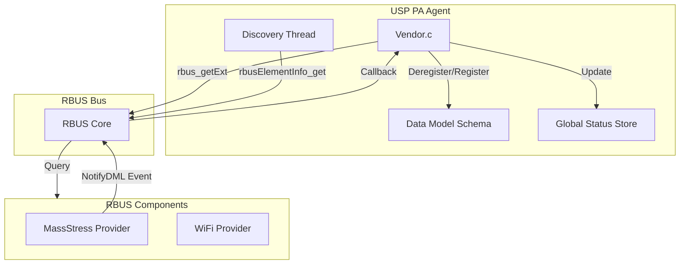
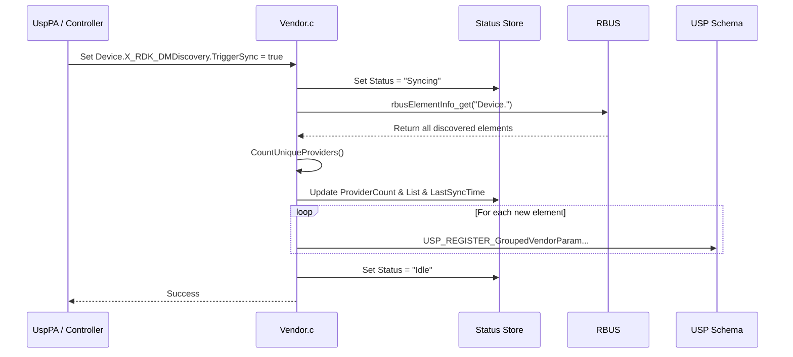
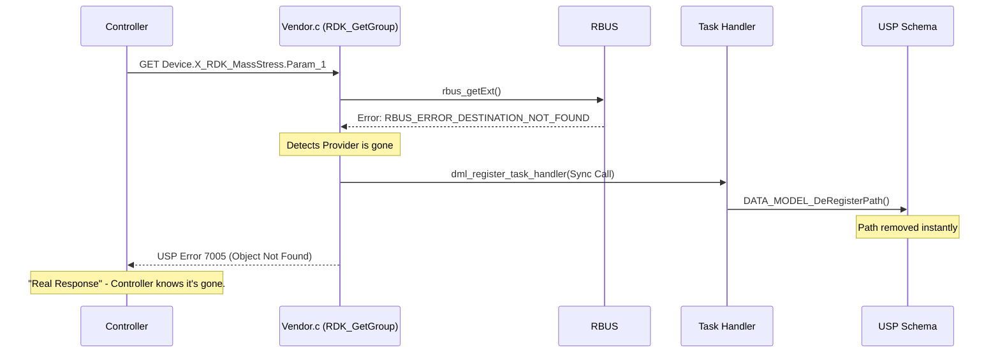

# RDK DM Discovery Extension - Architecture & Design

This document describes the extensions added to the **RDK-USP Discovery Engine** to provide better visibility into the data model synchronization status and improve error robustness.

## 1. Overview
The RDK DM Discovery extension adds a set of control and monitoring parameters under `Device.X_RDK_DMDiscovery.`. It also introduces a "Real Response" error handling mechanism that ensures the USP schema is always consistent with the underlying RBUS state.

### Key Features
*   **Real-time Status Tracking**: Monitor the engine's state (Idle, Syncing, Committing).
*   **Provider Insights**: See exactly which RBUS components are registered and how many parameters they provide.
*   **Fast Deregistration**: Instant schema cleanup when an RBUS provider dies.
*   **Accurate Error Reporting**: Returning USP Error 7005 (Object Not Found) instead of generic internal errors for missing providers.

---

## 2. Architecture Diagram

The system interacts between **usp-pa-vendor-rdk** (the Agent), the **RBUS Bus**, and external **RBUS Providers**.

---

## 3. Discovery Flow (TriggerSync)

When the user triggers a synchronization, the follow sequence occurs:

---

## 4. Error Handling: "Real Response" (GET)

This flow explains the fix for the reported "Error 7003" race condition when a provider is killed.

---

## 5. Function Reference

### `CountUniqueProviders(rbusElementInfo_t* elems, ...)`
*   **Purpose**: Scans the list of RBUS elements and extracts unique component namespaces (e.g., `Device.X_RDK_MassStress`).
*   **Action**: Updates the human-readable string `DiscoveredProviders` with element counts for each namespace.

### `RDK_GetGroup(int group_id, kv_vector_t *params)`
*   **Purpose**: Fetches parameter values from RBUS.
*   **New Logic**: If `rbus_getExt` returns a "Destination Not Found" error, it immediately triggers a synchronous deregistration of those paths and returns USP Error **7005**.

### `RDK_SyncDiscovery()`
*   **Purpose**: Performs a full bus scan.
*   **New Logic**: Resets the Provider List to `(none)` if no providers are found, ensuring the UI/parameters remain consistent with the zero count.

### `dml_register_task_handler(void* arg1, void* arg2)`
*   **Purpose**: Handles the actual registration/deregistration in the USP schema.
*   **New Logic**: Now accepts an `is_async` flag. If called synchronously (from a GET failure), it avoids freeing memory that might be on the stack.

---

## 6. Datamodel Summary (New Parameters)

| Parameter | Type | Access | Description |
| :--- | :--- | :--- | :--- |
| `TriggerSync` | Boolean | R/W | Trigger a full RBUS scan. |
| `TriggerCommit` | Boolean | R/W | Manually save discovered DM to flash. |
| `Status` | String | RO | Current state: `Idle`, `Syncing`, `Committing`. |
| `LastSyncTime` | DateTime| RO | ISO-8601 time of last completed sync. |
| `ProviderCount` | Unsigned| RO | Number of unique provider namespaces. |
| `DiscoveredProviders`| String | RO | Comma-separated list with element counts. |
